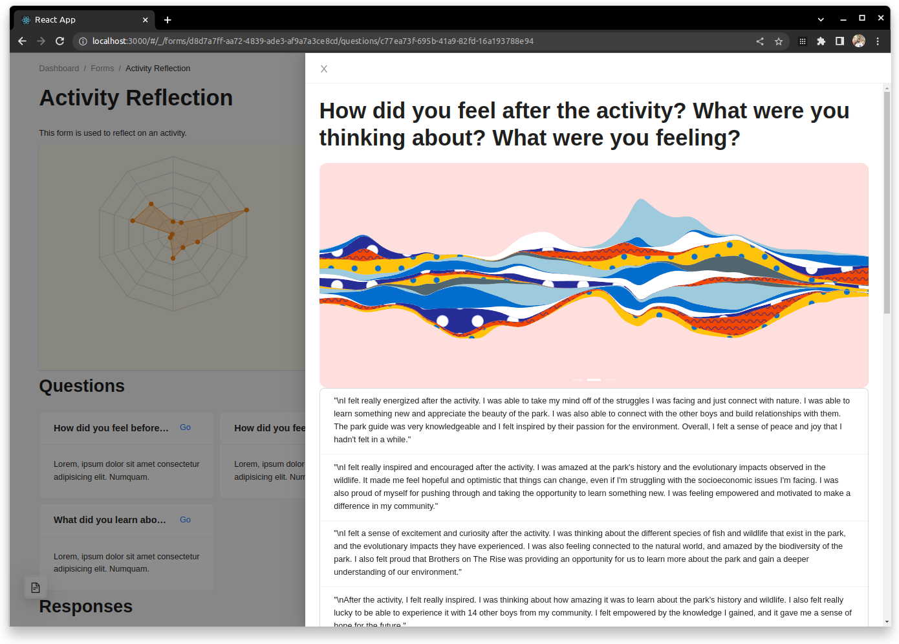

# Welcome to Wellytics

<!-- Inserts the image ./assets/dashboard.png centered -->
<p align="center">
  
</p>

Wellytics `work-in-progress` is a natural language processing (NLP) platform designed to analyze survey responses using machine learning algorithms. Our platform offers three key features: emotion analysis, keyword extraction, and metrics regressions. With Wellytics, you can quickly and easily analyze your survey responses to gain valuable insights into target audience.

This project was originally made as a Minerva University Cornerstone Civic Project (CCP) for the non-profit organization Brothers on The Rise as mechanism to quantify the impact their community activities has.

## Current state

In this repository, you can find the entire source code for the project, this includes the backend (written in Python) and the frontend (a web-app written in Typescript and React.js).

The backend's role is to store all the information, this includes forms, questions, responses, metrics and all the computed analytics.

The frontend's role is to be the interface from which both the user (in our case, Brothers on The Rise) and their target audience can see the analytics and input the responses, respectively.

Currently, we have implemented a fully-featured backend that is ready to be deployed in the Google Cloud Run platform as well as the Google Firestore database.

### Getting started

Here's an minimal example of how you could use the Application Programming Interface (API) defined in the backend:

```python
import time

import wellytics.api as api
from wellytics.models import Form, Question, Response
from wellytics.utils import uuid

now = int(time.time())

questions = [
    Question(
        id="question-1",
        createdAt=now,
        updatedAt=now,
        type="LongAnswer",
        required=True,
        question="How did you feel before the activity?"
    )
    Question(
        id="question-2",
        createdAt=now,
        updatedAt=now,
        type="LongAnswer",
        required=True,
        question="How do you feel now?"
    )
]


form = Form(
    id="form-1",
    createdAt=now,
    updatedAt=now,
    active=True,
    title="Activity Reflection",
    description="This form is used to reflect on an activity.",
    questions=["question-1", "question-2"],
)

responses = [
    Response(
        id=uuid(),
        createdAt=now,
        updatedAt=now,
        formId=_form.id,
        trackingId="user-1",
        answers={
            "question-1": "I felt really bad because (...)",
            "question-2": "Now I feel way better! (...)",
        },
    ),
    Response(
        id=uuid(),
        createdAt=now,
        updatedAt=now,
        formId=_form.id,
        trackingId="user-2",
        answers={
            "question-1": "(...)",
            "question-2": "(...)",
        },
    )
]

for question in questions:
    api.create_question(question)

api.create_form(form)

for response in responses:
    api.create_response(response)

form_analytics = api.get_form_analytics(form.id)
```

## Emotion Analysis

Wellytics uses machine learning algorithms to perform emotion analysis on survey responses. Our platform analyzes text data to identify the emotions expressed in each response and provides an emotion score for each response. With this feature, you can quickly determine the overall sentiment of your survey responses, identify key emotions expressed by respondents, and anonymously track changes in sentiment over time.

Our solution can detect and measure the following emotions:

```python
emotions = [
    "caring",
    "approval",
    "disapproval",
    "realization",
    "remorse",
    "desire",
    "curiosity",
    "excitement",
    "pride",
    "confusion",
    "relief",
    "admiration",
    "surprise",
    "neutral",
    "grief",
    "annoyance",
    "anger",
    "fear",
    "optimism",
    "nervousness",
    "disgust",
    "joy",
    "gratitude",
    "embarrassment",
    "amusement",
    "sadness",
    "love",
    "disappointment",
]
```

## Keyword Extraction

Wellytics also provides keyword extraction, which identifies the most important topics or keywords mentioned in survey responses. Our platform uses machine learning algorithms to identify the most frequently mentioned words or phrases in your survey responses, enabling you to quickly identify key themes or issues that are important to your respondents.

## Metrics Regressions

Wellytics provides metrics regressions to help you analyze the relationship between survey responses and key metrics. Our platform uses machine learning algorithms to identify the relationship between survey responses and metrics.

The challenge question for the CCP collaboration is:

> How can data analytics and descriptive statistics be applied to provide actionable information via a data-collecting digital platform to improve educational experiences for boys of color residing in Oakland?

This would imply measuring abstract concepts such as resilience. Since there's no explicit formula to compute such measurements, our solution was to build a framework that automatically detected correlations and made the most up-to-date predictions given the survey data and Reinforcement Learning from Human Feedback (RLHF).
